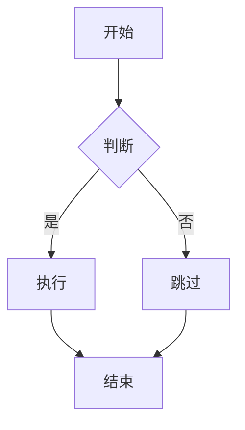

# Markdown 语法指南

> 这是一份完整的 Markdown 语法参考。打开分屏模式（代码 | 预览），左边学语法，右边看效果。

---

## 一、标题

```md
# 一级标题
## 二级标题
### 三级标题
#### 四级标题
##### 五级标题
###### 六级标题
```

# 一级标题
## 二级标题
### 三级标题
#### 四级标题
##### 五级标题
###### 六级标题

---

## 二、行内格式

```md
**加粗**  *斜体*  ~~删除线~~  `行内代码`
```

**加粗**  *斜体*  ~~删除线~~  `行内代码`

---

## 三、列表

### 无序列表

```md
- 事项一
- 事项二
  - 子事项（缩进两个空格）
```

- 事项一
- 事项二
  - 子事项（缩进两个空格）

### 有序列表

```md
1. 第一步
1. 第二步
1. 第三步
```

1. 第一步
1. 第二步
1. 第三步

> 预览中自动编号为 1, 2, 3。这是 Markdown 的设计——源码里全写 `1.` 就够了，方便你中间插入新行而不用手动改编号。

### 任务列表

```md
- [ ] 待办事项
- [x] 已完成事项
```

- [ ] 待办事项
- [x] 已完成事项

> `[ ]` 表示待办，`[x]` 表示已完成（x = checked，勾选☑）。注意 `]` 后面必须有空格。

---

## 四、引用

```md
> 这是一段引用
>
> 引用可以多段

> 引用还可以嵌套
>> 第二层引用
```

> 这是一段引用
>
> 引用可以多段

> 引用还可以嵌套
>> 第二层引用

---

## 五、代码块

用三个反引号包裹，标注语言可获得语法高亮：

`````md
```python
def hello():
    print("Hello, QuickMD!")
```

```rust
fn main() {
    println!("Hello, Rust!");
}
```
`````

```python
def hello():
    print("Hello, QuickMD!")
```

```rust
fn main() {
    println!("Hello, Rust!");
}
```

预览中代码块右上角会显示语言标签。支持：`js` `ts` `py` `rs` `json` `bash` `md` 等。

---

## 六、链接

```md
[QuickMD 项目](https://github.com)
<https://example.com>  直接网址也行
```

[QuickMD 项目](https://github.com)
<https://example.com>

---

## 七、图片

```md

```

支持本地绝对路径和网络 URL：

```md


```

> QuickMD 会自动加载本地图片并在预览中显示。拖入图片文件到编辑器也会自动生成引用。

---

## 八、表格

列与列之间用 `|` 隔开，表头和数据间用 `|---|` 分隔（至少三个短线）：

```md
| 姓名 | 年龄 | 城市 |
| ---- | ---- | ---- |
| 张三 | 28   | 北京 |
| 李四 | 32   | 上海 |
```

| 姓名 | 年龄 | 城市 |
| ---- | ---- | ---- |
| 张三 | 28   | 北京 |
| 李四 | 32   | 上海 |

> 分隔行中每格至少三个 `-`，多写几个也可以。预览里它们连成一条线——那是表格边框，不是分割线。

对齐方式：在分隔行的短线两侧加冒号。

```md
| 左对齐 | 居中 | 右对齐 |
| :----- | :--: | -----: |
| 内容   | 内容 | 内容   |
```

| 左对齐 | 居中 | 右对齐 |
| :----- | :--: | -----: |
| 内容   | 内容 | 内容   |

---

## 九、分割线

三个以上连字符独占一行。**前面必须空一行**，否则会被当成标题：

```md
上一段文字。

---

下一段文字。
```

上一段文字。

---

下一段文字。

---

## 十、Mermaid 图表

用 `mermaid` 标注语言，支持流程图、时序图、类图等：

`````md

`````


> Mermaid 语法丰富，QuickMD 支持其全部图表类型。详细语法请参考：
> https://www.processon.com/mermaid/flowchart

---

## 十一、脚注

用 `[^标签]` 在文中标记，文末用 `[^标签]: 内容` 定义：

```md
QuickMD 是一个极轻的桌面应用[^1]，专为闪念笔记设计[^2]。

[^1]: 基于 Tauri 2.x + React 构建。
[^2]: 也常被称为"便利贴"。
```

QuickMD 是一个极轻的桌面应用[^1]，专为闪念笔记设计[^2]。

[^1]: 基于 Tauri 2.x + React 构建。
[^2]: 也常被称为"便利贴"。

点击脚注编号可以跳到定义处，点击定义末尾的 ↩ 可以跳回来。

---

## 十二、HTML 嵌入

Markdown 语法覆盖不到的需求，可以直接写 HTML：

```md
<details>
<summary>点击展开更多内容</summary>

这里是被折叠的隐藏内容。可以用这种方式收纳不重要的备注信息。

</details>
```

<details>
<summary>点击展开更多内容</summary>

这里是被折叠的隐藏内容。可以用这种方式收纳不重要的备注信息。

</details>

---

## 十三、转义字符

想显示 Markdown 保留字符本身，在前面加反斜杠 `\`：

```md
\*星号不会被解析为斜体\*
\# 井号不会被解析为标题
\\ 显示反斜杠本身
```

\*星号不会被解析为斜体\*
\# 井号不会被解析为标题
\\ 显示反斜杠本身

> 以下字符可以用 `\` 转义：
> `\` `*` `_` `#` `` ` `` `~` `[` `]` `(` `)` `{` `}` `.` `!` `|` `>` `<`
>
> 注意：`$` 和 `%` 等符号不是 Markdown 保留字符，**不需要**也**不能**用 `\` 转义——加了反斜杠会原样显示反斜杠。


---

## 快捷键速查

| 快捷键 | 功能 |
| ------ | ---- |
| `Alt+Q` | 呼出/隐藏浮窗 |
